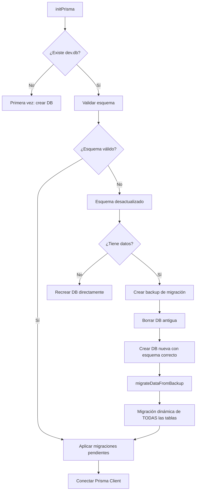

# Sistema de Migración Automática de Base de Datos

## 📋 Resumen

Este documento describe el sistema de migración automática implementado en `electron/main/prisma.ts` que preserva los datos del usuario cuando el esquema de la base de datos cambia entre versiones.

## 🎯 Problema Resuelto

Cuando se actualiza el esquema de Prisma (por ejemplo, renombrar columnas, agregar/eliminar tablas), la aplicación necesita:
1. Aplicar las migraciones de Prisma
2. **Preservar todos los datos del usuario**
3. Mapear columnas antiguas a nuevas si fueron renombradas
4. Funcionar automáticamente sin intervención del usuario

## 🏗️ Arquitectura del Sistema

### 1. Ubicaciones de Base de Datos

```
📁 Proyecto (development)
├── prisma/dev.db              # Template vacío (solo esquema)
└── prisma/migrations/         # Historial de migraciones

📁 Usuario (~/.../Application Support/ecclesia/)
├── dev.db                     # Base de datos REAL con datos del usuario
└── backups/                   # Backups automáticos
    ├── dev-2026-01-10T19-42-19-829Z.db        # Backups regulares
    └── migration-2026-01-10T19-42-19-829Z.db  # Backups de migración
```

### 2. Flujo de Inicialización



## 🔧 Componentes Principales

### 1. `backupDatabase()` - Sistema de Backup Confiable

**Ubicación**: `electron/main/prisma.ts:17-52`

**Funcionalidad**:
- Usa `VACUUM INTO` de SQLite para copiar bases de datos en uso
- Más confiable que `fs.copy()` para archivos SQLite abiertos
- Fallback a `fs.copy()` si VACUUM falla
- Crea backups con timestamp: `dev-2026-01-10T19-42-19-829Z.db`

**Uso**:
```typescript
const backupPath = await backupDatabase(dbPath)
// Retorna: /path/to/backups/dev-2026-01-10T19-42-19-829Z.db
```

### 2. `validateDatabaseSchema()` - Validación de Esquema

**Ubicación**: `electron/main/prisma.ts:139-175`

**Funcionalidad**:
- Usa `PRAGMA table_info(Lyrics)` para verificar columnas
- Detecta si el esquema está desactualizado
- Actualmente valida: `tagSongsId` vs `songsTagsId` en tabla Lyrics

**Cómo extender para validar más cosas**:
```typescript
async function validateDatabaseSchema(dbPath: string): Promise<boolean> {
  const db = sqlite3.default(dbPath)
  
  // Verificar tabla Lyrics
  const lyricsInfo = db.prepare('PRAGMA table_info(Lyrics)').all()
  const hasNewColumn = lyricsInfo.some(col => col.name === 'tagSongsId')
  
  // AGREGAR MÁS VALIDACIONES AQUÍ:
  // const mediaInfo = db.prepare('PRAGMA table_info(Media)').all()
  // const hasFilePath = mediaInfo.some(col => col.name === 'filePath')
  
  db.close()
  return hasNewColumn // && hasFilePath && ...
}
```

### 3. `COLUMN_MAPPINGS` - Mapeo de Columnas Renombradas

**Ubicación**: `electron/main/prisma.ts:177-185`

**Estructura**:
```typescript
const COLUMN_MAPPINGS: Record<string, Record<string, string>> = {
  Lyrics: {
    songsTagsId: 'tagSongsId'  // vieja → nueva
  },
  Media: {
    path: 'filePath'           // vieja → nueva
  }
}
```

**Cómo agregar nuevos mapeos**:
```typescript
const COLUMN_MAPPINGS: Record<string, Record<string, string>> = {
  Lyrics: {
    songsTagsId: 'tagSongsId'
  },
  Media: {
    path: 'filePath'
  },
  // AGREGAR AQUÍ cuando cambies nombres de columnas:
  Song: {
    author: 'authorName',        // Si renombras author → authorName
    oldColumn: 'newColumn'
  }
}
```

### 4. `migrateDataFromBackup()` - Migración Dinámica

**Ubicación**: `electron/main/prisma.ts:211-342`

**🌟 Característica Principal**: **100% DINÁMICA - No requiere cambios de código para nuevas tablas**

**Proceso**:
1. **Detecta todas las tablas** automáticamente (excluyendo `_prisma_migrations`, `sqlite_%`)
2. **Analiza esquema** de cada tabla en backup vs nueva BD
3. **Mapea columnas** usando `COLUMN_MAPPINGS` y detección automática
4. **Transforma datos** según reglas especiales
5. **Inserta datos** fila por fila
6. **Continúa** si una tabla falla (tolerante a errores)

**Ejemplo de log exitoso**:
```
🔄 Migrando datos desde backup al nuevo esquema...
📊 Tablas a migrar: Song, Lyrics, TagSongs, Themes, Setting, Media
📋 Migrando tabla: Song...
✅ 2 registros migrados en Song
📋 Migrando tabla: Lyrics...
✅ 2 registros migrados en Lyrics
📋 Migrando tabla: TagSongs...
✅ 4 registros migrados en TagSongs
📋 Migrando tabla: Themes...
✅ 1 registros migrados en Themes
📋 Migrando tabla: Setting...
✅ 0 registros migrados en Setting
📋 Migrando tabla: Media...
✅ 1 registros migrados en Media
✅ ¡Migración completada! 10 registros totales migrados
```

**Transformaciones especiales** (líneas 302-310):
```typescript
// Estas son transformaciones hardcodeadas para casos especiales
if (tableName === 'Media' && destCol === 'format' && !value) {
  value = row.type === 'VIDEO' ? 'mp4' : 'jpg'  // Inferir format desde type
}
else if (tableName === 'Media' && destCol === 'fileSize' && !value) {
  value = 0  // Default fileSize
}
else if (tableName === 'Media' && destCol === 'folder' && value === null) {
  value = ''  // NULL → string vacío
}
```

**Cómo agregar nuevas transformaciones**:
```typescript
// En el bloque de transformaciones especiales:
if (tableName === 'TuTabla' && destCol === 'tuColumna' && !value) {
  value = 'default_value'
}
else if (tableName === 'OtraTabla' && destCol === 'precio' && !value) {
  value = 0.0
}
```

### 5. Funciones Auxiliares

**`getAllTables(db)`** - Obtiene todas las tablas excluyendo sistema:
```typescript
function getAllTables(db: any): string[] {
  const tables = db.prepare(
    "SELECT name FROM sqlite_master WHERE type='table' " +
    "AND name NOT LIKE 'sqlite_%' AND name NOT LIKE '_prisma%'"
  ).all()
  return tables.map(t => t.name)
}
```

**`getTableSchema(db, tableName)`** - Obtiene esquema de una tabla:
```typescript
function getTableSchema(db: any, tableName: string): Map<string, any> {
  const schema = new Map()
  const columns = db.prepare(`PRAGMA table_info(${tableName})`).all()
  columns.forEach(col => schema.set(col.name, col))
  return schema
}
```

## 📝 Casos de Uso Comunes

### Caso 1: Agregar una nueva columna (nullable)

**Schema change**:
```prisma
model Song {
  id        Int      @id @default(autoincrement())
  title     String
  genre     String?  // ← Nueva columna nullable
}
```

**¿Qué hacer?**: 
✅ **NADA** - El sistema detecta automáticamente que la columna no existe en el backup y la deja como NULL.

---

### Caso 2: Agregar una nueva columna (NOT NULL con default)

**Schema change**:
```prisma
model Song {
  id        Int      @id @default(autoincrement())
  title     String
  views     Int      @default(0)  // ← Nueva columna con default
}
```

**¿Qué hacer?**: 
✅ **NADA** - SQLite aplica el default automáticamente.

---

### Caso 3: Renombrar una columna

**Schema change**:
```prisma
model Song {
  id          Int      @id @default(autoincrement())
  title       String
  authorName  String   // ← Renombrado de "author" a "authorName"
}
```

**¿Qué hacer?**:
1. **Crear la migración** de Prisma normalmente
2. **Agregar mapeo** a `COLUMN_MAPPINGS`:
```typescript
const COLUMN_MAPPINGS: Record<string, Record<string, string>> = {
  Song: {
    author: 'authorName'  // ← Agregar esta línea
  },
  Lyrics: {
    songsTagsId: 'tagSongsId'
  }
}
```
3. ✅ El sistema migrará automáticamente `author` → `authorName`

---

### Caso 4: Agregar una nueva tabla completa

**Schema change**:
```prisma
model Playlist {
  id          Int      @id @default(autoincrement())
  name        String
  description String?
  createdAt   DateTime @default(now())
}
```

**¿Qué hacer?**: 
✅ **NADA** - El sistema detecta automáticamente la nueva tabla y:
- Si existe en backup: migra los datos
- Si NO existe en backup: deja la tabla vacía

---

### Caso 5: Cambiar tipo de columna

**Schema change**:
```prisma
model Song {
  id       Int      @id @default(autoincrement())
  title    String
  duration Float    // ← Cambió de Int a Float
}
```

**¿Qué hacer?**:
⚠️ **Posible transformación manual**
- Si SQLite maneja la conversión automáticamente: ✅ funciona
- Si necesitas transformar valores: agregar lógica en transformaciones especiales

---

### Caso 6: Eliminar una columna

**Schema change**:
```prisma
model Song {
  id       Int      @id @default(autoincrement())
  title    String
  // author eliminado
}
```

**¿Qué hacer?**: 
✅ **NADA** - El sistema ignora columnas del backup que no existen en el nuevo esquema.

---

## 🚨 Validación de Esquema

### Actualizar `validateDatabaseSchema()` para nuevas migraciones críticas

Si haces un cambio **crítico** que debe forzar migración (como renombrar columnas), actualiza la validación:

```typescript
async function validateDatabaseSchema(dbPath: string): Promise<boolean> {
  const db = sqlite3.default(dbPath)
  
  // Validación existente
  const lyricsInfo = db.prepare('PRAGMA table_info(Lyrics)').all()
  const hasNewLyricsColumn = lyricsInfo.some(col => col.name === 'tagSongsId')
  
  // AGREGAR NUEVA VALIDACIÓN:
  const songInfo = db.prepare('PRAGMA table_info(Song)').all()
  const hasNewSongColumn = songInfo.some(col => col.name === 'authorName')
  const hasOldSongColumn = songInfo.some(col => col.name === 'author')
  
  db.close()
  
  // Si tiene columna vieja pero no la nueva, esquema desactualizado
  if (hasOldSongColumn && !hasNewSongColumn) {
    log.warn('⚠️ Columna "author" detectada - debe ser "authorName"')
    return false
  }
  
  return hasNewLyricsColumn && hasNewSongColumn
}
```

## 📊 Logs y Debugging

### Logs durante migración exitosa:

```
💾 Usando base de datos existente (preservando datos)
🔍 Validando esquema de base de datos...
⚠️ Columna antigua "songsTagsId" detectada - esquema desactualizado
⚠️ Esquema desactualizado detectado. Recreando base de datos...
💾 Creando backup antes de recrear...
⚠️ DATOS IMPORTANTES: Backup guardado en: /backups/migration-2026-01-10.db
🗑️ Base de datos antigua eliminada
✅ Base de datos limpia copiada desde el proyecto
🔄 Migrando datos desde backup al nuevo esquema...
📊 Tablas a migrar: Song, Lyrics, TagSongs, Themes, Setting, Media
📋 Migrando tabla: Song...
✅ 2 registros migrados en Song
[... más tablas ...]
✅ ¡Migración completada! 10 registros totales migrados
🎉 ¡Tus datos han sido migrados exitosamente al nuevo esquema!
🔄 Aplicando migraciones pendientes...
✅ Migraciones aplicadas
✅ Prisma conectado a la base de datos
```

### Si algo falla:

```
❌ Error migrando tabla Media: UNIQUE constraint failed: Media.id
```

**Solución**: Verificar que la tabla de destino esté vacía antes de migrar, o agregar lógica para manejar duplicados.

## 🧪 Testing del Sistema

### Probar una migración:

1. **Crear datos de prueba** en la app
2. **Cambiar el schema** (ej: renombrar columna)
3. **Crear migración**: `npx prisma migrate dev --name test_migration`
4. **Actualizar** `COLUMN_MAPPINGS` si renombraste columnas
5. **Actualizar** `validateDatabaseSchema()` si es cambio crítico
6. **Ejecutar** `yarn dev`
7. **Verificar logs** que muestren migración exitosa
8. **Verificar datos** en la aplicación

### Recuperación manual de backup:

Si la migración falla, los backups están en:
```
~/Library/Application Support/ecclesia/backups/
```

Para restaurar manualmente:
```bash
# Ver backups disponibles
ls -lh ~/Library/Application\ Support/ecclesia/backups/

# Copiar backup al archivo principal
cp ~/Library/Application\ Support/ecclesia/backups/migration-2026-01-10.db \
   ~/Library/Application\ Support/ecclesia/dev.db
```

## 📚 Historial de Cambios Importantes

### v1.0 - Sistema Básico (10 Ene 2026)
- ✅ Backup con VACUUM INTO
- ✅ Validación de esquema (Lyrics.tagSongsId)
- ✅ Migración dinámica de todas las tablas
- ✅ Mapeo de columnas: `songsTagsId → tagSongsId`, `path → filePath`
- ✅ Transformaciones especiales para Media

## 🎯 Mejoras Futuras Posibles

1. **UI de recuperación**: Panel en la app para restaurar backups manualmente
2. **Validación genérica**: Sistema de validaciones configurables en JSON
3. **Rollback automático**: Si migración falla, restaurar backup automáticamente
4. **Compresión de backups**: Comprimir backups antiguos para ahorrar espacio
5. **Límite de backups**: Mantener solo últimos N backups

## 💡 Principios de Diseño

1. **Preservar datos siempre**: El sistema NUNCA debe perder datos del usuario
2. **Automático**: No requerir intervención manual del usuario
3. **Dinámico**: Detectar tablas y esquemas automáticamente
4. **Tolerante a fallos**: Si una tabla falla, continuar con las demás
5. **Logging exhaustivo**: Registrar cada paso para debugging
6. **Backups confiables**: Usar VACUUM INTO para copias consistentes
7. **Extensible**: Fácil agregar mapeos y transformaciones

---

**Última actualización**: 10 de enero de 2026  
**Mantenido por**: Carlos Utrilla  
**Archivo fuente**: `electron/main/prisma.ts`
